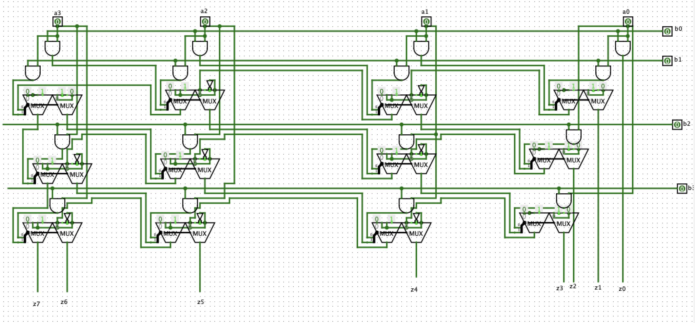

# Multiplicador

## Proceso para hacer el multiplicador 
[Proceso](https://github.com/Miguelelizondov/Multiplicador/blob/master/Proceso%20para%20hacer%20multiplicador%20de%204%20bits.pdf)
## Esquemático 
[Logisim](https://github.com/Miguelelizondov/Multiplicador/blob/master/ADDER%20.circ)
## Fotos del esquemático
### MUX

### HALF ADDER

### FULL ADDER

### Multiplicador

